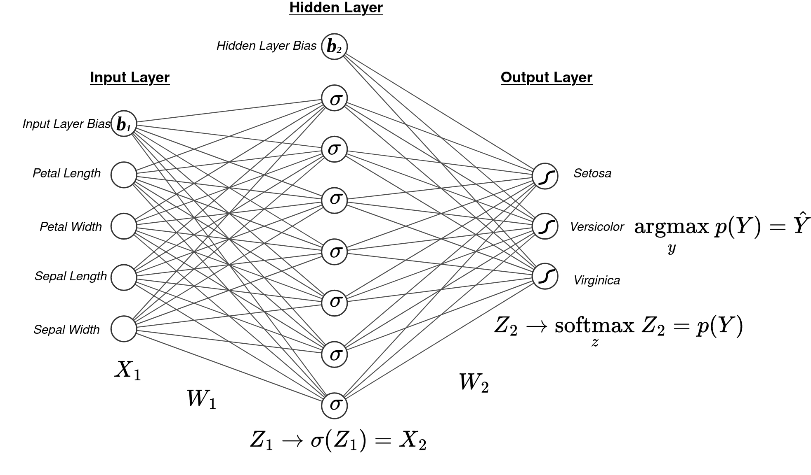

# Part 1

## Problem Formulation

This problem is formulated in the following way:

- **Algorithm**: K-Nearest Neighbors Classifier
- **Goal State**: Correct classifications of input vectors of unknown class. 
- **Distance Metrics**:
   - Euclidean distance $\sqrt{\sum_{i=1}^n(X_i - Y_i)^2}$
   - Manhattan distance $\sum_{i=1}^n|X_i-Y_i|$

## Solution Overview

The *K Nearest Neighbors* algorithm classifies a sample by comparing it to the class of $K$ nerest neighbors and assigning it as the most frequently occurring class. To determine the nearest neighbors, a *distance metric* is computed between the sample and the other "training" vectors with known classes and those which minimize the distance metric are considered closest. 

This implementation uses two distance metrics: Euclidean distance and Manhattan distance. These equations are described in the previous section. The *closesness* of the distance metrics of the nearest neighbors determine the sample's class, and are computed in two ways: 

- The *Uniform* closeness assigns an equal weight to the class of all the nearest neighbors.
- The *Weighted* closeness assigns a class weight proportional to the distance of the neighbor to the sample, such that the class of neighbors closest to the sample will be weighted higher than those further away. 

This implementation is highly performant and is on par with the `SKLearn` implementation, their performance comparisons are shown below. They perform exactly the same.

```python
import numpy as np
import pandas as pd

print('Difference in Model Performance Compared to SKLearn')

knn_digits_html = pd.read_html("knn_digits_results.html")
knn_digits_df = knn_digits_html[0].dropna()

knn_iris_html = pd.read_html("knn_iris_results.html")
knn_iris_df = knn_iris_html[0].dropna()

knn_digits_perf = np.mean(knn_digits_df['Accuracy Score'].diff()[1::2])
knn_iris_perf = np.mean(knn_iris_df['Accuracy Score'].diff()[1::2])

print(f'KNN Performance on Digits: {knn_digits_perf:.1%}')
print(f'KNN Performance on Iris: {knn_iris_perf:.1%}')
```

```
Average Difference in Model Performance Compared to SKLearn
KNN Performance on Digits: 0.0%
KNN Performance on Iris: 0.0%
```

# Part 2

## Problem Formulation

This problem is formulated in the following way:

- **Algorithm**: MultiLayer Perceptron Classifier (aka Shallow Neural Network)
- **Goal State**: Correct classifications of input vectors of unknown class. 
- **Model Architecture**:
   - Activations: *identity*, *sigmoid*, *tanh*, *relu*
   - Loss Function: *cross-entropy*
   - Optimizer: *gradient descent*

## Solution Overview

Where a single Perceptron is composed of a logistic regression function given by the linear combination of the input vector and a set of weights corresponding to the vector dimensions, a Multilayer Perceptron acts as an ensemble of Perceptrons, whose outputs are then used to classify the input vector or regress a value from it. This program implements the multilayer perceptron algorithm, also known as a *Shallow Neural Network*. For our purpose, we are constructing a Neural Network for classification of handwritten digits from pixels or the flower type from petal measurements. In either case, we are given a training set of vectors for each which are labeled with the correct classification values. 

### Feed Forward Classification

The first phase of the neural network algorithm is to *feed forward* the vector values through the network to estimate the output. This diagram below shows the model architecture computing the classification of the iris flower based on the given inputs for petals and sepals:



In this model, the *input layer* is composed of a vector of measurements for the sample flower's petals and sepals, and a bias term. There is a single *hidden layer* composed of 7 neurons and a bias term. The *output layer* is composed of a vector of 3 dimensions, which represent the probability of a flower belonging to a given class of Iris species.

The input vector $X_1$ is first passed to each of the hidden layer neurons by the linear combination with the input layer weights $W_1$, and a bias term $b_1$.

$$X_1 \cdot W_1 + b_1= Z_1$$

The result of the linear combination $Z_1$ is then processed at each neuron to determine the input to the next layer (in order to *feed* it *forward*) by an activation function $\sigma(Z_2) = X_2$. These activation functions can come in a variety of forms, and are discussed in more detail in the [Hyperparameterization section](#Hyperparameterization).

The linear combination of the hidden layer output $X_2$ with the output layer weights $W_2$ estimate the values for the final layer $Z_2$. These values are converted to probabilities by the *softmax* function. This represents the probability of each class as dimensioned by the output layer:

$$\underset{z}{\textrm{softmax}}\space Z_2 = \frac{e^{z - \textrm{max}(Z_2)}}{\sum_{i=1}^ne^{z - \textrm{max}(Z_2)}} = p(Y)$$

Therefore, the output layer dimension with the highest probability is the estimated class of the input vector $X_1$:

$$\underset{y}{\textrm{argmax}}\space p(Y) = \hat{Y}$$

### Loss Optimization and Backpropagation

In order for the algorithm to "learn", it needs to update the weights so that when it runs a new unknown input vector it can accurately predict the class. For a multi-class error, the *Cross-Entropy Loss* can be computed between the one-hot-encoded class label and the predicted class:

$$L(Y,\hat{Y}) = -\sum_{i=1}^k y_i \log{\hat{y}_i}$$

The goal is to find the set of weights which minimize this loss. In achieving this, the algorithm will have "learned" the correct weights and will be a strong classifier. After each iteration, the weights can be updated by the *gradient descent* algorithm by subtracting from the original weight vector the gradient of the error with respect to the weights $\frac{\partial \mathcal{E}}{\partial W}$, multiplied by an arbitrary *learning rate* constant $\eta$:

$$W \leftarrow W - \eta\frac{\partial \mathcal{E}}{\partial W}$$

This is applied to all the weights across the network through a process called *backpropagation* whereby the errors are "backpropagated" from the output weights to the first hidden layer weights using the chain rule. The output layer weight gradient is first computed by the following:

$$\frac{\partial \mathcal{E}}{\partial W_2} = \frac{\partial \mathcal{E}}{\partial \hat{Y}}\frac{\partial \hat{Y}}{\partial Z_2}\frac{\partial Z_2}{\partial W_2} = (\hat{Y} - Y) \cdot X_2^T$$

By the chain rule, the hidden layer weight gradient is computed by the following:

$$\frac{\partial \mathcal{E}}{\partial W_1} = \frac{\partial \mathcal{E}}{\partial \hat{Y}}\frac{\partial \hat{Y}}{\partial Z_2}\frac{\partial Z_2}{\partial X_2}\frac{\partial X_2}{\partial Z_1}\frac{\partial Z_1}{\partial W_1} = \left(\left(W_2^T \cdot (\hat{Y} - Y)\right) \odot \sigma'(Z_1)\right) \cdot X_1^T$$

Where: 
- superscript $T$ is the *transpose* matrix operator
- $\sigma'$ is the derivative of the activation function $\sigma$
- $\odot$ is the *hadamard product* matrix operator
- $\cdot$ is the *dot product* matrix operator

After updating the weights (and biases) in this way by gradient descent, the neural network has completed it's first *epoch* of learning. Hypothetically, with these improved weights it will do a better job predicting the class of the input vector on the next time. 

### Hyperparameterization

While this is all good in principle, the actual performance of the neural network greatly depends on the choice of *hyperparameters* which configure the models performance. These subsections below discuss the choice of hyperaparameters and the various ways they affect model performance:

#### Hidden Units, Epochs, and Learning rate

The number of *hidden layer units*, or the number of neurons in the hidden layer, allow for more abstraction of the classification problem. This essentially amounts to finding more or fewer latent features which can be exploited for classification. In general, more is better but too many can mean that many of the weights are not being used - this becoes inefficient and can slow down the model since it has to do more unnecessary calculations. 

The number of *epochs* is the number of learning iterations (feed forward + backpropagation) the model will complete. Again, generally more is better, but at some point the model can overfit to the training data or more learning will become unnecessary since the model's performance may have reached a plateau. 

The *learning rate* affects the amount of gradient that is applied to update the weights at each epoch. This often depends greatly on the topology of the response surface (error surface) over which the optimization is occurring. If a learning rate is too fast, it will bounce around the minima never to reach it. However, if the learning rate is too slow it might never reach the minima (or will take a very long time IE many many epochs).

These are all explored in the `main.py` through cross-validation. 

#### Activation functions

Here is a table of the activation functions used in this experiment, and their derivatives:

Activation | Function | Derivative
-----------|----------|-----------
Linear | $f(x)=x$ | $f'(x)=1$
Sigmoid | $f(x)=\frac{1}{1 + e^{-x}}$ | $f'(x)=\frac{1}{1 + e^{-x}} * \left(1 - \frac{1}{1 + e^{-x}}\right)$
Hyperbolic Tangent (TanH) | $f(x)=\tanh(x)$ | $f'(x)=1-\tanh(x)^2$
Rectified Linear Units (ReLU) | $f(x) =\max(x, 0)$ | $f'(x)=\begin{cases} 1 & x > 0 \\ 0 & \textrm{otherwise} \end{cases}$

The choice of activation function in the hidden layer plays an important role in the computations. It establishes the number space for the hidden layer outputs, for example a sigmoid output will be between 0 and 1, while an hyperbolic tangent output will be between -1 and 1. This is nice because it allows for control over the output of the linear combinations and can prevent too large or too small of numbers being generated (which can have a negative affect on both learning and classification).

Perhaps more importantly, this choice also affects the shape of the *derivative* of the activation function. This is an important consideration for controlling the "flow" of the gradient errors during backpropagation. For example, a linear activation function has a derivative of 1, so when the error propagates backward it will always only be updated by $1 \times \eta$ or $-1 \times \eta$ or 0. This might eventually work, but its not an ideal update mechanism since each update will be by a step of the learning rate. 

#### Initialization

Of course, how the weights are randomly initialized also will play a role in the performance of the neural network. For this model, we applied *He Normal* initialization by selecting weights randomly from the normal distribution given by:

$$\mathcal{N}\left(0, \sqrt{\frac{2}{n}}\right)$$

Where $n$ is the length of the input feature vector for the set of weights. This initialization scheme is commonly used and performs quite well.

## Performance

Below is explored the performance between this homegrown Multilayer Perceptron implementation and that given by the popular `SKLearn` framework. For the Iris dataset, the homegrown model is quite performant and only underperforms the `SKLearn` implementation by a few percentage points, on average. However, the homegrown model does not do quite as well for the digits dataset. Its hard to say exactly why this is. In any case, `SKlearn` has had years and years of optimization and research put into it so we should probably just use that (or `PyTorch` or `TensorFlow`) for any actual work that needs to be done with a neural network. 

```python
import numpy as np
import pandas as pd

print('Difference in Model Performance Compared to SKLearn')

mlp_digits_html = pd.read_html("mlp_digits_results.html")
mlp_digits_df = mlp_digits_html[0].dropna()

mlp_iris_html = pd.read_html("mlp_iris_results.html")
mlp_iris_df = mlp_iris_html[0].dropna()

mlp_digits_diff = mlp_digits_df['Accuracy Score'].diff()[1::2]
mlp_iris_diff = mlp_iris_df['Accuracy Score'].diff()[1::2]

activations = ['identity', 'sigmoid', 'tanh', 'relu']

print('\nAverage MLP Performance on Digits')
for i in range(4):
    activ_d_perf = np.mean(mlp_digits_diff[i*27:(i+1)*27])
    print(f'{activations[i]} {activ_d_perf:.1%}')

print('\nAverage MLP Performance on Iris')
for i in range(4):
    activ_i_perf = np.mean(mlp_iris_diff[i*27:(i+1)*27])
    print(f'{activations[i]} {activ_i_perf:.1%}')
```

```
Average Difference in Model Performance Compared to SKLearn

MLP Performance on Digits
identity -30.2%
sigmoid -27.5%
tanh -19.5%
relu -23.0%

MLP Performance on Iris
identity -9.4%
sigmoid -5.5%
tanh -5.9%
relu -6.3%
```

## Summary of Work Performed

The git history shows a good summary of changes and work performed, as this repository was freshly initialized from the contents of `cs-b551-fa2023/assignment-a5`. 

**Jonathan**

- Code writing of `k_nearest_neighbors.py`, `multilayer_perceptron.py`, and `utils.py`.

**Mark**

- Code review and cleanup, `SILO` testing, and optimization of `k_nearest_neighbors.py`, `multilayer_perceptron.py`, and `utils.py`.
- Report writing for all sections
- Git admin, markdown formatting + NN plot
